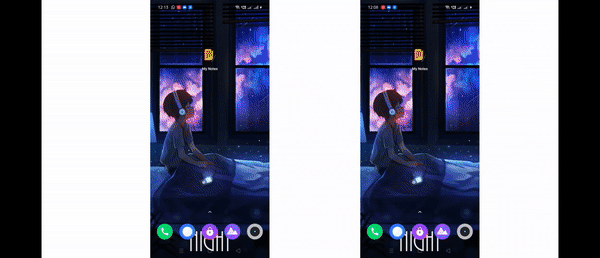

# Notes App

It is a notes app which is based on neumorphism user interface and also provide dark theme.

## Architecture
Based on mvvm architecture and repository pattern.  

## Specs & Open-source libraries
- Minimum SDK 21
- 100% Kotlin based
- MVVM Architecture
- Architecture Components (Lifecycle, LiveData, ViewModel, Room Persistence)
- [DataBinding](https://developer.android.com/topic/libraries/data-binding) for data binding
- [Dagger2](https://github.com/google/dagger) for dependency injection
- [Glide](https://github.com/bumptech/glide) for loading images
- [NeumorphismView-Android](https://github.com/thelumiereguy/NeumorphismView-Android) for neumorphism user interface in android

## Upcoming
- Stick with the project i am uploading all test files regarding this project.
- Adding More features regularly.

## Contribution
Feel free to generate any issue regarding the project and if you want to send PR ,feel free to first dicussion in the issue and then send PR , i will be happy to accept
your PR.

## License
-----
 Copyright 2021 Ankit kumar

    Licensed under the Apache License, Version 2.0 (the "License");
    you may not use this file except in compliance with the License.
    You may obtain a copy of the License at

    http://www.apache.org/licenses/LICENSE-2.0

    Unless required by applicable law or agreed to in writing, software
    distributed under the License is distributed on an "AS IS" BASIS,
    WITHOUT WARRANTIES OR CONDITIONS OF ANY KIND, either express or implied.
    See the License for the specific language governing permissions and
    limitations under the License.
